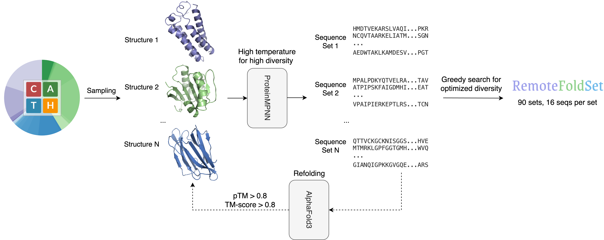

# RemoteFoldSet: Benchmarking Structural Awareness of Protein Language Models

This repository provides the dataset, metrics, and analysis code for **RemoteFoldSet**.  

Read the [paper](#) (link coming soon).  


## Introduction
  - In this work, we constructed RemoteFoldSet, a dataset of proteins with high structural similarity but low sequence identity. The dataset comprises 90 protein sets representing diverse folds, with alternative low-identity sequences generated via ProteinMPNN and filtered for foldability using AlphaFold3.

  - Together with the dataset, we introduced the Structural Awareness (SA) score and the SA distance ratio, a pair of new metrics for assessing pLM embeddings, which are model-agnostic, unsupervised, and training-free.

  - Based on these, we benchmarked widely used protein language models (pLMs), including UniRep, ProGen2, CARP, ESM, and ProtTrans.  

## Dataset generation


To ensure that the selected starting structures were distributed across the known structural space, we sampled proteins from clusters of the [CATH dataset](https://www.cathdb.info/). As shown in the workflow, we then used [ProteinMPNN](https://github.com/dauparas/ProteinMPNN) to generate diverse alternative sequences for each selected structure, and refolded these generated sequences using [AlphaFold3](https://github.com/google-deepmind/alphafold3) to ensure that they could fold back into the originally selected structure. Finally, we performed a greedy search (see [`greedysearch.ipynb`](notebooks/greedysearch.ipynb)) to optimize the diversity within each retained protein sequence set.

You can download the current version of the dataset from [**`RemoteFoldSet_domain_to_seqs.pkl`**](saved/RemoteFoldSet_domain_to_seqs.pkl). It currently contains 90 protein sets, each comprising 16 sequences (1,440 sequences in total), with a mean sequence diversity of 0.74. The dataset is stored as a dictionary, where each key corresponds to the name of a CATH domain:
```python
{
  "3p5pa02": ["YRHWGATASVALLERLW...", "KPDMYQQSEVAKLVRDD...", ...],
  ...
}
```

## Detect structural awareness
We evaluate structural awareness in pLMs using two model-agnostic, unsupervised metrics:

- [**Structural Awareness (SA) Score**](metrics/sa_score.py): Quantifies the extent to which embeddings capture fold-level similarity beyond sequence identity.

- [**SA Distance Ratio**](metrics/sa_distance_ratio.py): Compares intra-set to inter-set distances to assess discriminability of the embeddings.

Read the full definitions of the SA Score and SA Distance Ratio in Sections 3.2 and A.3 of the paper.

## Experiments
We benchmarked several widely used pLMs on RemoteFoldSet. The models included in our benchmark are listed in the table below.

| Model            | Architecture  | Objective  | Size | Layers              | Embedding Dim |
| :----------------: | :-------------: | :----------: | :----: | :---------: | :-------------: |
| [UniRep](https://github.com/churchlab/UniRep)           | mLSTM         | Next-token | 18M  | 1                   | 1900          |
| [ProGen2 (base)](https://github.com/salesforce/progen)   | GPT-style     | Next-token | 764M | 27                  | 1536          |
| [ProGen2 (large)](https://github.com/salesforce/progen)  | GPT-style     | Next-token | 2.7B | 32                  | 2560          |
| [ProGen2 (xlarge)](https://github.com/salesforce/progen) | GPT-style     | Next-token | 6.4B | 32                  | 4096          |
| [CARP (640M)](https://github.com/microsoft/protein-sequence-models)      | ByteNet-style | MLM        | 640M | 30                  | 1280          |
| [ESM-1b](https://github.com/facebookresearch/esm)           | BERT-style    | MLM        | 650M | 33                  | 1280          |
| [ESM-2 (650M)](https://github.com/facebookresearch/esm)     | BERT-style    | MLM        | 650M | 33                  | 1280          |
| [ESM-2 (3B)](https://github.com/facebookresearch/esm)       | BERT-style    | MLM        | 3B   | 36                  | 2560          |
| [ESM-2 (15B)](https://github.com/facebookresearch/esm)      | BERT-style    | MLM        | 15B  | 48                  | 5120          |
| [ProtBert](https://github.com/agemagician/ProtTrans)         | BERT-style    | MLM        | 420M | 30                  | 1024          |
| [ProtT5 (XL-U50)](https://github.com/agemagician/ProtTrans)  | T5-style      | Span MLM   | 3B   | 24e/24d | 1024          |


The corresponding precomputed embeddings for each model have been released in the [`embeddings/`](embeddings/) directory.